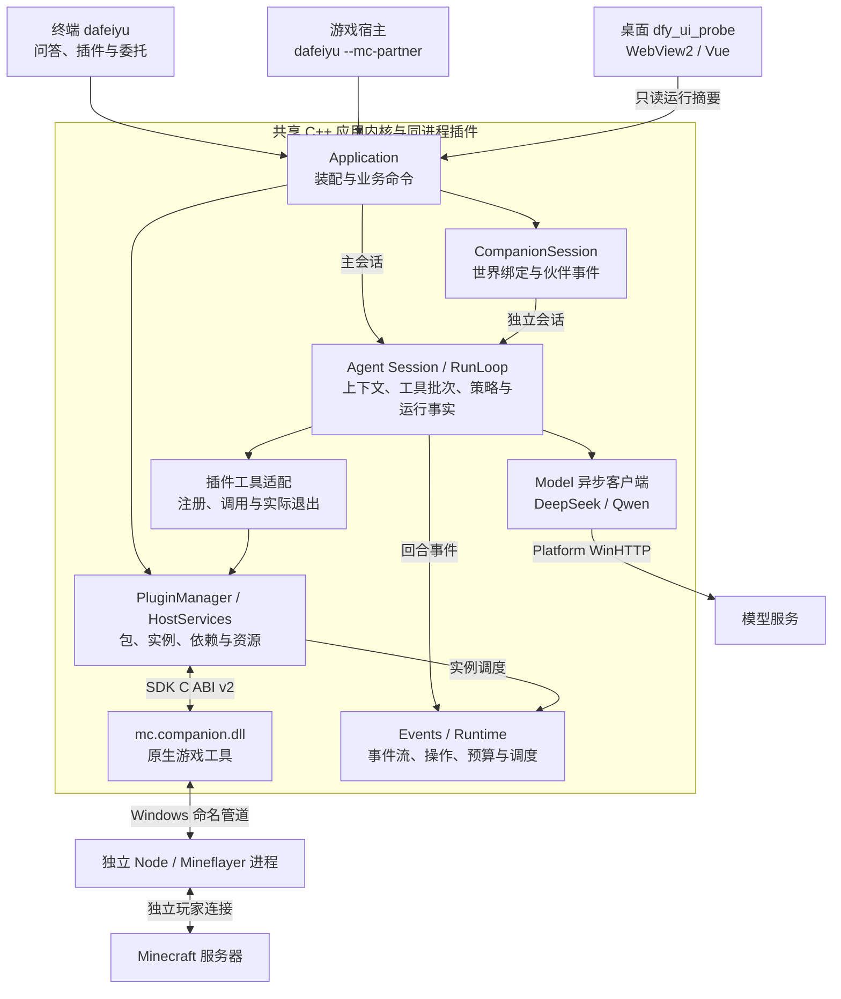
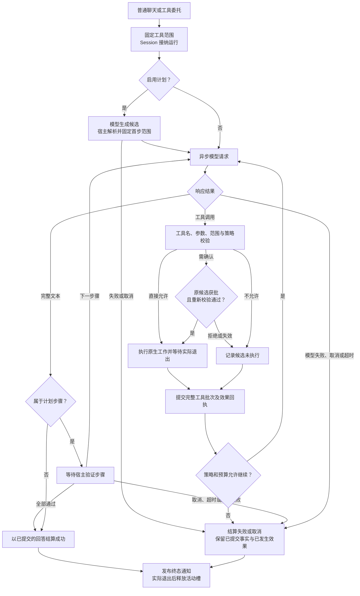
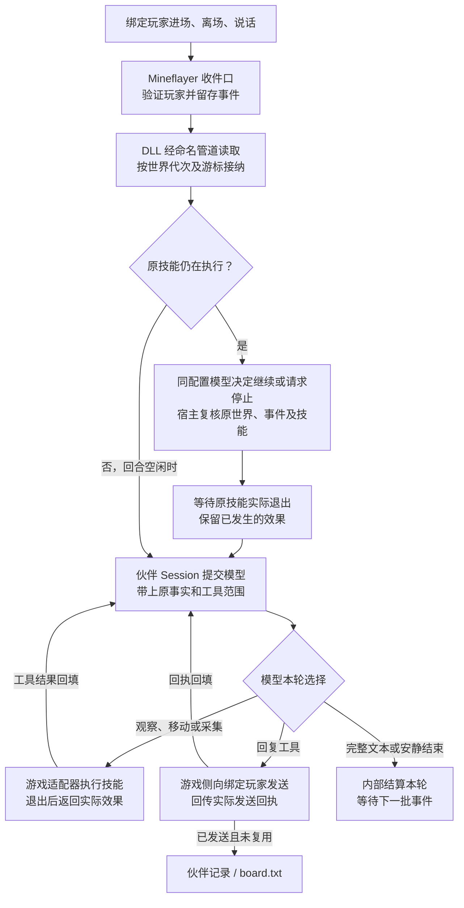
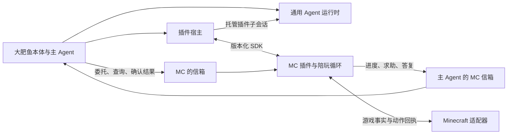
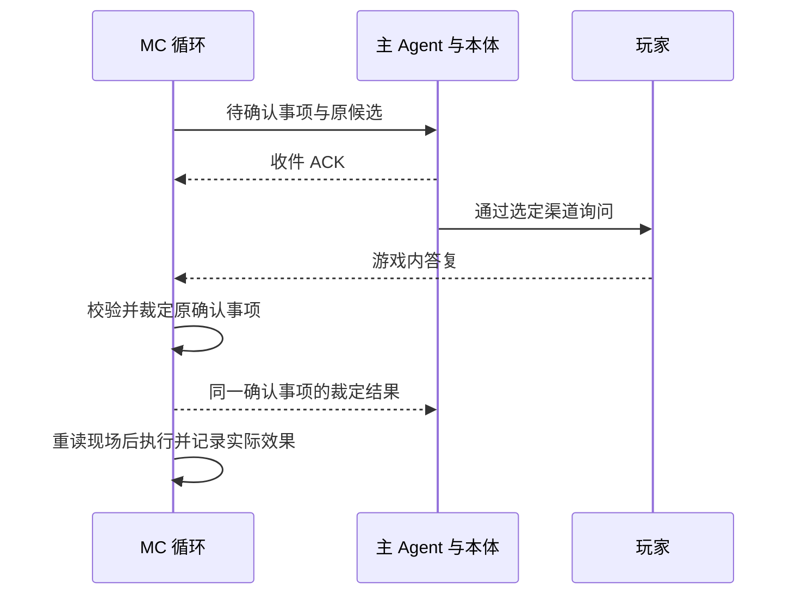

# 大肥鱼当前架构

代码基线为 `343d5ed`。大肥鱼通过共享的 `Application` 装配会话、插件管理和事件通道。终端与 MC 伙伴已经接入实际业务。桌面探针在自己的业务线程装配同一套服务，向页面提供只读运行摘要，另有独立的空闲与忙碌房间预览。

## 架构图

箭头表示运行时调用或数据方向。终端、专用游戏宿主和桌面探针按各自入口创建应用实例。

```mermaid
---
config:
  flowchart:
    rankSpacing: 28
    nodeSpacing: 24
---
flowchart TB
    Terminal["终端 dafeiyu<br/>问答、插件与委托"]
    GameHost["游戏宿主<br/>dafeiyu --mc-partner"]
    Gui["桌面 dfy_ui_probe<br/>WebView2 / Vue"]

    subgraph Host["共享 C++ 应用内核与同进程插件"]
        App["Application<br/>装配与业务命令"]
        Partner["CompanionSession<br/>世界绑定与伙伴事件"]
        Agent["Agent Session / RunLoop<br/>上下文、工具批次、策略与运行事实"]
        Model["Model 异步客户端<br/>DeepSeek / Qwen"]
        Tools["插件工具适配<br/>注册、调用与实际退出"]
        Plugins["PluginManager / HostServices<br/>包、实例、依赖与资源"]
        Mc["mc.companion.dll<br/>原生游戏工具"]
        Events["Events / Runtime<br/>事件流、操作、预算与调度"]
        App -->|主会话| Agent
        App --> Partner
        Partner -->|独立会话| Agent
        App --> Plugins
        Agent --> Model
        Agent --> Tools
        Agent -->|回合事件| Events
        Tools --> Plugins
        Plugins -->|实例调度| Events
        Plugins <-->|SDK C ABI v2| Mc
    end

    Terminal --> App
    GameHost --> App
    Gui -->|只读运行摘要| App
    Model -->|Platform WinHTTP| Service["模型服务"]
    Mc <-->|Windows 命名管道| Bridge["独立 Node / Mineflayer 进程"]
    Bridge <-->|独立玩家连接| Minecraft["Minecraft 服务器"]
```

| 模块 | 职责与源码入口 |
| --- | --- |
| **App** | 组装模型、插件和主会话，接纳终端工具授权、审批与状态读回。普通聊天、`--mc-partner` 和桌面探针共享应用服务代码。另有 `--complete` 直接调用模型的单次文本入口。[命令行](../app/main.cpp) · [Application](../app/application.cpp) · [Conversation](../app/conversation.cpp) |
| **Agent** | `Session` 持有当前运行和有界历史。每个 `RunLoop` 根据本轮工具快照、策略及预算推进模型、工具、可选计划和诊断。主会话与伙伴会话分别持有自己的上下文。[Session](../agent/session.cpp) · [RunLoop](../agent/run_loop.cpp) · [策略](../agent/execution_policy.cpp) |
| **Model / Platform** | Model 编解码请求并通过异步客户端接收完整响应。HTTP、控制台输入、DLL 装载和摘要算法属于 Windows Platform。默认 Provider 内置，空插件目录可直接问答。[模型客户端](../model/client.cpp) · [协议](../model/protocol.cpp) · [WinHTTP](../platform/winhttp.cpp) · [代码装载](../platform/code_module.cpp) |
| **Plugins / SDK** | 运行时负责包发现、显式安装与加载、独立设置、活动实例和卸载。安装完成后还需显式启用。卸载依据依赖关系、对象持有和工作实际退出状态完成，等待或失败时保留相应资源。面向正式实例的契约为 v2 C ABI。[管理器](../plugins/runtime/manager.cpp) · [工具适配](../plugins/tools/native_work.cpp) · [v2 契约](plugin-abi-v2.md) |
| **Runtime / Events** | Runtime 提供类型与值、操作状态、资源所有者、预算和调度。Events 提供有界广播、订阅和处理。回合通知携带身份及状态，正文留在会话，通知接纳与回合结果独立结算。[运行时目标](../runtime/CMakeLists.txt) · [广播通道](../events/broadcast_channel.cpp) · [通知接纳](../agent/session.cpp) |
| **Desktop** | WebView2 主文档通过 `state.read` 获取当前或最近运行摘要，可按会话号和回合号筛选。桌面原生业务线程发布值副本，房间预览取固定样本。[业务线程](../app/gui/run_status_host.cpp) · [主文档桥接](../ui/host/probe_host.cpp) · [运行说明](ui-probe-run-guide.md) |

构建入口是 CMake 和 VS2022 x64，宿主采用 C++20，公开 SDK 支持 C 消费者。终端是默认启动目标，`BUILD_GUI` 和 `BUILD_TESTING` 控制探针和测试目标。[根构建](../CMakeLists.txt) · [预设](../CMakePresets.json) · [分发规则](../cmake/Distribution.cmake)

## Agent 会话与工具流程

```mermaid
---
config:
  flowchart:
    rankSpacing: 28
    nodeSpacing: 24
---
flowchart TB
    Input["普通聊天或工具委托"] --> Session["固定工具范围<br/>Session 接纳运行"]
    Session --> Mode{"启用计划？"}
    Mode -->|是| Prepare["模型生成候选<br/>宿主解析并固定首步范围"]
    Prepare --> Model["异步模型请求"]
    Prepare -->|失败或取消| Stop
    Mode -->|否| Model
    Model --> Response{"响应结果"}
    Response -->|工具调用| Check["工具名、参数、范围与策略校验"]
    Check -->|直接允许| Work["执行原生工作并等待实际退出"]
    Check -->|需确认| Approval{"原候选获批<br/>且重新校验通过？"}
    Approval -->|是| Work
    Approval -->|拒绝或失效| Rejected["记录候选未执行"]
    Check -->|不允许| Rejected
    Work --> Results["提交完整工具批次及效果回执"]
    Rejected --> Results
    Results --> Continue{"策略和预算允许继续？"}
    Continue -->|是| Model
    Continue -->|否| Stop["结算失败或取消<br/>保留已提交事实与已发生效果"]
    Response -->|完整文本| Plan{"属于计划步骤？"}
    Plan -->|是| Verify["等待宿主验证步骤"]
    Verify -->|下一步骤| Model
    Verify -->|全部通过| Done["以已提交的回答结算成功"]
    Verify -->|取消、超时或运行失败| Stop
    Plan -->|否| Done
    Response -->|模型失败、取消或超时| Stop
    Done --> Exit["发布终态通知<br/>实际退出后释放活动槽"]
    Stop --> Exit
```

- **普通问答**每轮接收一次完整文本。成功时提交整轮对话。失败或取消后，仍保留先前已经提交的对话与工具事实。[历史提交](../agent/run_context.cpp) · [会话推进](../agent/session.cpp)
- **终端委托**中，`/run` 授予一个只读工具，`/run-confirmed` 允许具体变更候选进入审批。`/task` 固定同一个插件实例上的首读、变更、末读，宿主核对步骤顺序、实际回执和期望值。原候选的批准与实际调用分开记录。[应用入口](../app/application.cpp) · [工具批次](../agent/tool_batch.cpp) · [读回验证](../app/tool_verification.cpp)
- **原生观察与计划控制**通过显式宿主入口接纳。观察触发默认只读，变更分支要求声明条件、可信当前采样和确认。计划步骤支持有界重规划、目标修订和等待验证时换入新观察。诊断和离线比较沿用运行身份和版本信息。[观察控制](../agent/observation_controller.cpp) · [计划与观察入口](../agent/session.cpp) · [离线场景](../tests/offline_scenario.cpp)

## MC 伙伴的事件与动作流程

```mermaid
---
config:
  flowchart:
    rankSpacing: 28
    nodeSpacing: 24
---
flowchart TB
    Player["绑定玩家进场、离场、说话"] --> Inbox["Mineflayer 收件口<br/>验证玩家并留存事件"]
    Inbox --> Read["DLL 经命名管道读取<br/>按世界代次及游标接纳"]
    Read --> Busy{"原技能仍在执行？"}
    Busy -->|是| Review["同配置模型决定继续或请求停止<br/>宿主复核原世界、事件及技能"]
    Review --> Exit["等待原技能实际退出<br/>保留已发生的效果"]
    Exit --> Decide
    Busy -->|否，回合空闲时| Decide["伙伴 Session 提交模型<br/>带上原事实和工具范围"]
    Decide --> Choice{"模型本轮选择"}
    Choice -->|观察、移动或采集| Skill["游戏适配器执行技能<br/>退出后返回实际效果"]
    Skill -->|工具结果回填| Decide
    Choice -->|回复工具| Reply["游戏侧向绑定玩家发送<br/>回传实际发送回执"]
    Reply -->|回执回填| Decide
    Reply -->|已发送且未复用| Board["伙伴记录 / board.txt"]
    Choice -->|完整文本或安静结束| Finish["内部结算本轮<br/>等待下一批事件"]
```

默认伙伴模式将玩家原话和在场变化作为有序事件，已接纳工作由原票据跟踪，新事件让旧回合在下一控制边界停止继续发起调用。实际发言来自 `reply` 工具，回合终态文本留在内部，技术故障进入系统状态。固定圆石场景使用独立的 `scenario` 模式，包含显式委托及场景专用拾取与返程证据。[伙伴会话](../app/companion_partner.cpp) · [原生技能注册](../plugins/mc/native.cpp) · [游戏技能实现](../plugins/mc/bridge/partner.cjs) · [MC 插件运行说明](../plugins/mc/README.md)

## 当前边界

当前架构靠三条边界维持可追溯性。模型提出动作，由宿主定义工具和审批范围。插件回执区分动作效果与工作退出，宿主据此保留已经发生的事实。桌面读取值副本，业务状态由其宿主管理。会话、审批和运行记录主要驻留进程内。MC 跨回合持续目标、通用动作调度，以及桌面对话投递、审批和伙伴面板属于后续设计。[运行诊断](../agent/diagnostic_snapshot.cpp) · [MC 交互方案](mc-companion-development-plan.md) · [桌面主面板方案](main-agent-room-development-plan.md)

## 架构调整方案

2026-11-20 评审确定目标边界，迁移从 `1d47ce2` 开始。上面的运行流程描述迁移前的行为。每条新路径通过定向验证后更新对应的实现说明。

```mermaid
flowchart LR
    Product[大肥鱼本体与主 Agent] --> Runtime[通用 Agent 运行时]
    Product --> Host[插件宿主]
    Host -->|托管插件子会话| Runtime
    Host <-->|版本化 SDK| MC[MC 插件与陪玩循环]
    MC -->|进度、求助、答复| MainBox[主 Agent 的 MC 信箱]
    MainBox --> Product
    Product -->|委托、查询、确认结果| PluginBox[MC 的信箱]
    PluginBox --> MC
    MC <-->|游戏事实与动作回执| Game[Minecraft 适配器]
```

- **本体**持有主 Agent、用户交互和固有能力。房间服务按角色实际可感知范围生成事实，内置模型后端支持空插件目录问答。
- **Agent 运行时**统一推进模型和工具，负责上下文、权限、审批、预算、取消、效果与实际退出。应用和插件子会话分别持有自己的会话范围。
- **插件宿主**拥有信箱寻址、插件工作归属、子会话托管、Hook 注册及退出回收。新增 C ABI 能力表独立协商版本。
- **MC 插件**拥有外层陪玩循环和 MC 世界状态。玩家事件、长动作、回复投递和确认升级由插件推进。主 Agent 可向插件询问进度和委托任务。

### 信箱、唤醒与确认

主 Agent 为直接对话、房间和获准插件分别接收消息。插件循环也持有自己的接收信箱。信箱 ID 标识目的地，分类标识处理方式，发送方及实例代次从宿主绑定取得。每箱有接收顺序和容量，跨信箱消息通过询问、委托或动作身份关联。旧实例的地址和发送权在注销后失效。

收件方可以主动读取，也可以按分类配置到件触发。触发先登记待处理输入，再由会话按空闲或忙碌状态选择下一处可用边界。位置和进度可按显式规则合并。委托、确认与动作终态在容量不足时返回明确的拒收结果，可按原身份重投或查询。首版 ACK 的保证限于当前进程的接纳及去重窗口。

```mermaid
sequenceDiagram
    participant MC as MC 循环
    participant Main as 主 Agent 与本体
    participant Player as 玩家
    MC->>Main: 待确认事项与原候选
    Main-->>MC: 收件 ACK
    Main->>Player: 通过选定渠道询问
    Player-->>MC: 游戏内答复
    MC->>MC: 校验并裁定原确认事项
    MC-->>Main: 同一确认事项的裁定结果
    MC->>MC: 重读现场后执行并记录实际效果
```

游戏内和主面板的答复使用同一个确认标识。原任务接纳第一条通过人、时效、候选及世界代次校验的答复。后到的答复读取已经裁定的结果。收件超时可以按原消息 ID 重投，玩家无回应时按业务授权决定继续、改方案或升级。子 Agent 自行决定与玩家明确批准各有记录。动作的接纳、实际效果及退出按原动作身份管理。

### Hook 注册与执行

插件载入时声明 Hook 点和适用范围，范围可含整个主会话。宿主校验完整依赖图并检测环，再按稳定拓扑顺序固定各 Hook 表。依赖已满足的插件按注册顺序取用，同一插件内按处理器注册顺序取用。每次触发持有当前顺序快照，相关工作实际退出后才能释放插件模块。

完整接口覆盖消息入轮、模型请求发出前、模型响应收到后、工具实际执行前后和回复投递前。先从正式运行已有的模型请求、工具启动、工具结果三个控制点接入。修改按字段合并，独立处理器对同一字段提交不同结果时报告冲突，显式接续的处理器可逐步改写。控制对最终候选作出允许、拒绝或等待决定。候选改变后重新校验和审批。工具效果保留原始回执，观察通知独立推进。[现有控制点](../agent/include/dafeiyu/execution_policy.hpp) · [生命周期依赖](../plugins/runtime/dependencies.cpp)

### 迁移顺序和验收

| 步骤 | 交付 | 定向验证 |
| --- | --- | --- |
| 1 | 固定设计、当前源码职责和兼容入口。 | 核对链接、图和当前运行入口。 |
| 2 | 复用定向事件通道，建立地址、分类、接纳回执和去重，再接入收件及唤醒。 | 双向投递、范围隔离、容量、重投、旧实例及收件顺序。 |
| 3 | 建立加载期排序和运行快照，逐个接入 Hook 控制点。 | 共同依赖、传递依赖、环、字段冲突、审批后复核、退出回收。 |
| 4 | 开放插件子会话宿主能力，以小型测试插件接入。 | 上下文隔离、工具范围、模型替身回合、取消与实际退出。 |
| 5 | 依次迁移玩家原话到实际发言、插话到动作回执、升级确认到原任务恢复。 | 保留 `--mc-partner` 入口及固定圆石场景的可验证行为，逐条比较原入口回执。 |
| 6 | 清理共享应用层的 MC 分支，更新当前架构图及 SDK 指南。 | 验收空插件问答、正式 MC 伙伴、跨渠道确认、断线卸载和完整离线分发。 |

实现阶段依次确定信箱队列与溢出规则、Hook 挂起与故障预算、子 Agent 会话和世界绑定的寿命。首轮默认子 Agent 可沿用主程序所选模型配置。主面板怎样呈现游戏伙伴由产品界面方案决定。每个功能点单独验证并提交，完整 CTest 与分发验证在最终验收运行。开发使用固定模型响应、传输替身和本地游戏。[验证约定](../AGENTS.md) · [当前终端入口](../app/companion_host.cpp) · [固定场景取证](../tests/mc-companion/README.md)
